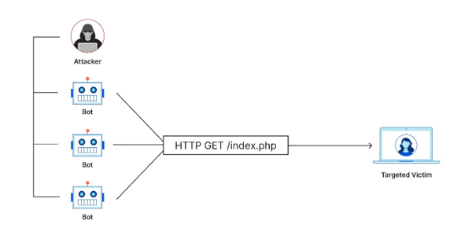

# DDoS (Distributed Denial-of-Service)
DDoS (Distributed Denial-of-Service), bir ağ, sistem veya hizmetin normal işleyişini engellemek amacıyla birden fazla kaynaktan eş zamanlı olarak gerçekleştirilen aşırı yükleme saldırısıdır. Bu tür saldırılar, hedef sistemin kaynaklarını tüketerek hizmetin kullanıcılar tarafından erişilemez hale gelmesine yol açmaktadır. 
 
## DDoS Saldırısı Nasıl Çalışır? 
DDoS (Distributed Denial-of-Service) saldırıları, birden fazla bilgisayar veya cihazın, hedef sistem veya hizmete eş zamanlı ve koordineli bir şekilde aşırı trafik göndermesi ile gerçekleştirilen siber saldırılardır. Bu saldırılar, genellikle botnet adı verilen, zararlı yazılımlar aracılığıyla ele geçirilmiş ve saldırgan tarafından kontrol edilen cihaz grupları aracılığıyla gerçekleştirilir.  

# Kimlik Avı (Phishing) 
## Kimlik avı saldırısı nedir? 
Kimlik avı, genellikle oturum açma kimlik bilgileri ve kredi kartı numaraları da dahil olmak üzere kullanıcı verilerini çalmak için kullanılan bir tür sosyal mühendislik saldırısıdır. Güvenilir bir varlık gibi davranan bir saldırgan, kurbanı bir e-postayı, anlık iletiyi veya kısa mesajı açması için kandırdığında ortaya çıkar. Alıcı daha sonra kötü amaçlı bir bağlantıya tıklaması için kandırılır, bu da kötü amaçlı yazılımların yüklenmesine, bir fidye yazılım saldırısının parçası olarak sistemin donmasına veya hassas bilgilerin açığa çıkmasına neden olabilir. 
### Kimlik Avı Saldırısı Türleri: 
#### Email phishing
    •	Bu tür kimlik avı saldırısı en yaygın olanıdır. Saldırganlar, bankalar, sosyal ağ siteleri veya devlet kurumları gibi saygın kuruluşlar tarafından gönderilmiş gibi görünen yanıltıcı e-postalar gönderir. E-postaların yoğunluğu genellikle alıcıları zararlı bağlantılara tıklamaya, kötü amaçlı ekleri indirmeye veya kişisel bilgileri ifşa etmeye teşvik eder. 
#### Spear phishing
    •	Hedef odaklı kimlik avı kullanan saldırılar daha spesifik ve hedeflidir. Saldırganlar hedeflerini araştırır ve onları harekete geçmeye teşvik etmek için özelleştirilmiş mesajlar oluşturur. E-postaların daha inandırıcı görünmesini sağlamak ve başarı şanslarını artırmak için sosyal medyadan veya diğer kaynaklardan toplanan verilerden yararlanabilirler. 
#### Whaling
    •	Balinalara yönelik saldırılar açıkça CEO'lar, üst düzey yöneticiler veya tanınmış kişiler gibi yüksek profilli kişilere yöneliktir. Saldırganlar, hedeflerini gizli bilgileri ifşa etmeleri veya finansal işlemler gerçekleştirmeleri için kandırmak için güvenilir kişiler veya işletmeler gibi davranırlar. 

# Zararlı Yazılım Türleri ve Analizi 
Malware kavramı Malicious-Software yani Zararlı Yazılım kelimelerinin birleşiminden oluşmaktadır. Bilgisayar sistemlerinde çeşitli şekillerde bulaşıp zarar veren, veri çalan, sistemleri devre dışı bırakan yazılımları temsil eder.  
Malware örnekleri: 
    •	Trojan 
    •	Backdoor 
    •	Rootkit 
    •	Ransomware 
    •	Adware 
    •	Worm 
    •	Spyware gibi farklı amaçlara hizmet eden kötü amaçlı yazılım türleridir. 
 
Malware iletilirken e-posta, tarayıcı hataları, dosya paylaşım hizmetleri, kablosuz ağlar ve bluetooth gibi çeşitli yöntemler kullanılabilir. 

## Trojan 
Trojan, zararsız bir uygulama gibi gösterilen ama aslında sistem üzerinde zararlı faaliyet gösterecek bir virüs türüdür. Örneğin İçine bir backdoor gömülen bir fotoğraf veya belge olabilir.  

## Worm (Solucan) 
Worm, diğer virüslerden farklı olarak kendini çoğaltabilir ve yayılmak için bir programa veya kullanıcı eylemine gerek duymazlar. Worm, Aynı ağ üzerindeki sistemleri tarayarak güvenlik açıklarını arar ve bulduğu güvenlik açıklarından faydalanarak hedef sisteme bulaşarak kendisini kopyalarlar. Genellikle çok hızlı bir şekilde yayılır. Diğer saldırı türlerine ilk projemin raporunda değiniyorum. 
 
# Ag Guvenlik Protokolleri: 
Ağ güvenliği, ağınıza izinsiz ve yetkisiz girişleri engellemek, veri hırsızlığının önüne geçmek ve olası tehditlerden korunmak için gereklidir. Ağ güvenliğini sağlarken ağ içinde farklı noktalarda çeşitli donanımlar ve yazılımlar kullanılarak kontroller uygulanır. Ağ güvenlik araçları aşağıdaki gibidir. 
    •	VPN (Virtual private network) 
    •	Antivirüs 
    •	Firewall (Güvenlik duvarı)  

## VPN 
İnternet trafiğini harici bir proxy sunucusu üzerinden kanalize ederek tüm bilgileri koruyabilirsiniz. Kamuya açık ağlarda VPN ile bağlanarak MITM saldırılarından kaçınabiliriz. 
 
## Firewall (Güvenlik duvarı) 
Güvenlik duvarı, ağa gelen giden paket trafiğini kontrol eden yazılım veya donanım ürünüdür. Ağınız ile dış ağlar arasında bir engel oluşturarak erişim kontrolü ve makro/micro ağ bölümlemesini gerçekleştirir. 
 
## Antivirüs 
Antivirüs, birden çok koruma katmanı ile sadece virüsleri değil aynı zamanda tüm zararlı yazılımları tespit edip, engelleyen ve silen, kullanıcıları siber tehditlere karşı koruyan güvenlik yazılımlarına verilen addır. 

# Wi-Fi Protected Access II (WPA2) 
Kablosuz ağlarda kullanılan bir güvenlik protokolüdür. WPA2, daha önceki standardı olan WPA’nın yerini almış ve daha güçlü bir şifreleme yöntemi olan Advanced Encryption Standard (AES) kullanmaktadır.  
WPA2, kablosuz ağ trafiğini şifrelemek ve güvenliğini sağlamak için kullanılır. AES, güçlü bir blok şifreleme algoritmasıdır ve 128-bit veya 256-bit anahtar uzunluğuyla çalışabilir. Bu, saldırganların ağ trafiğini dinleyerek veya şifreleri kırarak verilere erişmelerini önleyen daha güvenli bir şifreleme yöntemidir. 
WPA2 ayrıca Wi-Fi ağının güvenliğini artırmak için çeşitli güvenlik önlemleri sunar. Bunlar arasında ağ kimlik doğrulaması için Pre-Shared Key (PSK) veya Enterprise (EAP) kimlik doğrulama yöntemlerinin kullanılması, geçici anahtarlarla trafiğin şifrelenmesi gibi özellikler yer almaktadır. Wi-Fi Protected Access III (WPA3) 
WPA3 aslında WPA2 nin gelişmiş versiyonudur. 
WPA3-Kurumsal, parola gücünü artırmak için şifrelemeyi 192 bit değerine çıkarır (WPA3-Kişisel modda 128 bit) bu özellik, tahmin yoluyla kolayca kırılabilecek zayıf şifre kullanımını engeller.   
Saldıranlar trafik şifreleme anahtarı kullansalar bile, WPA3-Kişisel ile trafik kullanımı ve aktarılan verileri hesaplamak artık daha güç. SAE, açık bir ağda da iletme gizliliği ve çok daha güvenli bir veri güvenliği aktarımını sağlar. WPA3 aynı zamanda halka açık bir alanda gizlice dinleme ve sahteciliğin önüne geçmek için korumalı yönetim çerçeveleri (PMF) özelliği sağlar. 
 
# Kurumsal Ag Guvenligi Politikalari
Teknoloji, hem bireysel hem de kurumsal hayatta bir parçamız olmasının yanı sıra, kendi gelişimiyle doğru orantılı gelişen ve değişen, saldırı ve tehditlere direnmede de hala yolda olan, bu süreci hiçbir zaman tamamlanmayacak yaşayan bir oluşum diyebiliriz. 
İnsanlar ve şirketler bu süreç dahilinde, geçmişten günümüze, saldırı ve tehlikelere geliştirdikleri yazılımlarla karşı koymaya çalışsalar da bu alanda %100 başarı sağlamak mümkün görünmüyor. Ne kadar kötülcül olsa da, yapılan saldırılarda teknolojinin bir parçası. Birkaç örnek bakmamız gerekirse;

    •	Virüs yazılımı, kullanıcının bir eki manuel olarak açmasını ve bir virüs yaymasını engellemez. 
    •	Şirketteki hemen herkesin erişebilirliği varsa alıcı güvenli değildir. 

Bu ve bu gibi durumlar karşımıza çıkar. Sebep budur ki, teknolojide nasıl daha iyi güvenlik politikaları oluştururuz sorusuna giden yolda adım adım ilerleyelim. 
 
## 1-	Geliştirme Politikaları 
Departmanlardaki geliştiricilerin güvenli kod yazması gerekmektedir. SQL injection gibi saldırılara önlem alınmalıdır. Güvensiz kod RCE, RAT gibi uzaktan erişim sağlayan zararlıların içeri sızmasına sebep olabilir. Tüm bağlantılar güvenli iletişime uygun olmalıdır. Örnek; Mesajlaşma için TransferLayerSecurity SSL gibi uçtan uca şifrelemeler kullanılmalıdır. Yazılım aldığımız zaman güvenlik açığı olmadığını doğrulayan imzalı belgeler almalıyız. BT ekibinin güvenlikten emin olması ve ne yapılacağından, nasıl yapılacağından haberdar olması için kodun dokümantasyonu yazılmalı ve açıklanmalıdır. 
 
## 2-	Erişim Kontrol Tanımlamaları 
Kişilere erişim yetkisi verilirken katı olunmalı ve bu yetkinin “neden gerektiği” sorusu sorulmalıdır. Kaynaya erişen kişi sayısı arttıkça ihlal riski de artar. Temel ayrıcalıklarla birlikte izin verilene kadar tüm kullanıcıların erişiminin engellenmesidir. Bir nevi beyaz liste. 
Bundan dolayı birçok şirkette yetki matrisi oluşturulur. Böylelikle insanların yetkisinin ulaştığı yere kadar sorun çıkartabilir. 
Örneğin CryptoLocker gibi virüsler bilgisayarın ulaşabildiği yere her şeyi şifreler. Bu nedenle hem virüslere karşı hem de kişinin ihtiyacı olmayacağı yerlere giriş engellenerek yetki matrisi ile işimizi garantiye almış oluruz. 
 
## 3-	Siber Güvenlik Farkındalık Eğitimi 
Siber Güvenlik Farkındalığı Eğitimi, Dünya genelinde birçok şirket oltalama (phishing) saldırısına maruz kalmıştır. Bu kötü niyetli faaliyetler nedeniyle, birçok şirket mali kayba ve itibar kaybına uğradı. Şirketler siber güvenlik farkındalık eğitimi ile çalışanlarını siber saldırılara karşı eğitebilir. Böylece siber güvenlik farkındalık eğitimi ile çalışanlar, değerli şirket bilgilerinin çalınmasını başarıyla önleyebilecektir. 

•	Eğitim programını sürekli güncel tutun. 
İçerik yenileme, eğitim verimliliğini artırmanın önemli bir parçasıdır. Dijital dünyanın sürekli değiştiğini hatırlamak önemlidir, bu nedenle zamana ayak uydurmalısınız. 

•	Doğru konuyu seçin. 
Çalışanlarınıza verdiğiniz eğitimler sadece çalışma süreci için değil, aynı zamanda özel hayatları için de oldukça faydalı olacaktır. Oltalama’nın (phishing) Siber güvenlik farkındalığı eğitimini tercih ederek ilk adımı atabilirsiniz. Doğru konu, başarılı bir siber güvenlik farkındalığı eğitiminin anahtarıdır. 

•	Boşlukları analiz edin. 
Çalışanların hangi zorluklar yaşadığını görün ve eğitiminizi iyileştirin. Çalışanın performansını karşılaştırmak ve onlara daha fazla bilgi sağlamak için istatistikleri kullanabilirsiniz. 

•	Geri bildirim alın. 
Çalışanlarınıza sorun. Sürecin tüm adımları onlar için anlaşılır mıydı? Konuları anladılar mı? Eğitim sırasında neyi sevdiler ve neyi sevmediler? Neyi geliştirmek isterler? Bunları dikkate alarak doğru çözümü tercih ederek eğitimi daha etkin hale getirin. 

# Yapay Zeka
# Yapay Zekâ ve Makine Öğreniminin Ağ Güvenliğindeki Rolü 
Yapay zekâ ve makine öğrenimi de ağ güvenliğini iyileştirmede giderek daha önemli bir rol oynuyor ve tehditlerin otomatik olarak tanımlanabilmesi ve hızlı bir şekilde harekete geçilebilmesi için ağdaki davranışlar hakkında daha iyi bilgi veriyor. 
Otomatik bir yaklaşım olarak, yapay zekâ ve makine öğrenimi günün her saatinde çalışır ve kesinti süresi olmadan ağın sürekli ve sürekli yönetimini ve kontrolünü sağlar, bu da ek hizmet iyileştirmeleri anlamına gelir. 
Yapay zekâ destekli ağ yönetimi, ağın işleyişini kolaylaştırmak, sorun gidermek ve iyileştirmek için merkezi bir öneme sahiptir. Yapay zekâ ve makine öğreniminin herhangi bir ağın sorunsuz çalışması için gerekli olduğu zamana hızla yaklaşıyoruz. 
 
# Bulut Tabanlı Güvenlik Çözümleri 
Bulut bilişim modelinin giderek yaygınlaşmasıyla birlikte, hesaplamaların bulut dışında gerçekleştirilmesi, kaynakların paylaşımı ve bulutlar tarafından sunulan dış veri depolama hizmetleri gibi yeni kavramlar ortaya çıkmaktadır. Ancak bu durum, güvenlik ve gizlilik endişelerini artırmakta ve yeni güvenlik zorluklarına yol açmaktadır. 
Özellikle mobil cihazlara taşınan bulut sistemleri ve doğrudan bulut altyapısına erişim imkânı sağlanması, bulut güvenliği için birçok tehdit ve zafiyet yaratmaktadır. Bu nedenle, bulut bilişim sistemlerinin güvenliği ve gizliliği korumak için sürekli olarak gözden geçirilmesi ve iyileştirilmesi gerekmektedir. 
 
# İnternet Nesnelerin (IoT) Güvenliği Nedir? 
Nesnelerin İnterneti için güvenlik, internet cihazlarını ve bağlandıkları ağları çevrimiçi tehditlere ve ihlallere karşı korumak anlamına gelir. Bu, cihazlar arasında potansiyel güvenlik açıklarını belirleyerek, izleyerek ve ele alarak elde edilir. En basit hâliyle IoT güvenliği, IoT sistemlerini güvende tutan uygulamadır. 
 
# IoT güvenliği neden önemlidir? 
IoT sadece bilgisayarlar veya akıllı telefonlarla ilgili değildir; açma/kapama anahtarı olan hemen hemen her şey potansiyel olarak internete bağlanabilir ve bu da onu Nesnelerin İnterneti’nin bir parçası hâline getirir. IoT’yi oluşturan “nesnelerin” hacminin büyüklüğü ve çeşitliliği, önemli miktarda kullanıcı verisi içerdiği anlamına gelir. Tüm bu veriler, siber suçlular tarafından çalınma veya saldırıya uğrama potansiyeline sahiptir. Ne kadar çok cihaz bağlanırsa, siber suçluların güvenliğinizi tehlikeye atması için o kadar fazla fırsat olur. 

# Bir çalışan aracılığıyla kimlik avı saldırısı ile veri sızıntısı 
## Gercek Bir Ornek
 2020 Twitter Hack Olayı Olay özeti: 
    •	Tarih: Temmuz 2020 
    •	Hedef: Twitter’ın dahili yönetim araçlarına (admin paneli vb.) erişim 
    •	Yöntem: Sosyal mühendislik ve kimlik avı (phishing) teknikleri 
Saldırının hikayesi 
Saldırganlar, Twitter çalışanlarını hedef alan kimlik avı (phishing) mesajları veya telefon aramaları (voice phishing- vishing) gerçekleştirdiler. Mesajlar, şirket içi gibi görünen sahte portallara yönlendiren linkler içeriyordu ya da telefonda “BT ekibinden” arıyor gibi davranıp çalışanı kandırdılar. Çalışan, linke tıklayıp kurumsal kimlik bilgilerini (kullanıcı adı, şifre, hatta 2FA kodu) girdi. Artık bilgiler saldırganların eline geçti ve çalışan hesabına uzaktan giriş yapabildiler. 
Ele geçirilen çalışan hesabı gerekli yetkilere sahipti veya benzer yetkileri olan başka bir hesaba (veya sisteme) pivot (yatay hareket) yapma olanağı verdi. 
Saldırganlar, sistem içindeki kritik bilgilere erişti. Aynı zamanda birçok yüksek profilli hesabın kontrolünü ele geçirdiler. Bu hesaplar üzerinden kripto para dolandırıcılığı yaparak para topladılar. Şirket içi verilerin ve kullanıcı verilerinin de tehlikeye girme ihtimali oldukça yüksekti. 
Şüpheli hareketlerin fark edilmesi üzerine Twitter acil durum önlemleri aldı. Bazı hesapların kilitlendiği, dahili erişimlerin askıya alındığı ve saldırının boyutunun araştırıldığı bir süreç yaşandı. 
 
Akış şeması ve dolandırılan birkaç kişinin görselleri aşağıdaki gibidir; 

Saldırı sonrası alınan dersler ve çözümler: 
•	Şirket içi siber güvenlik eğitimlerinin düzenli yapılması, gerçekçi kimlik avı testleri düzenlenmesi gerçekten çok büyük önem taşıyor. 
•	2FA veya MFA (Çift/Çok Faktörlü Doğrulama) sistemlerinin zorunlu kullanımı.  
•	Dahili sistemlere erişim rolleri ve izinlerinin en az ayrıcalık prensibine göre tanımlanması.  
•	Gelişmiş kimlik avı filtresi ve e-posta güvenlik ağ geçitleri kullanılması. 
 

## 📚 Kaynakça
- [2020 Twitter Bitcoin Dolandırıcılığı – Vikipedi](https://tr.wikipedia.org/wiki/2020_Twitter_bitcoin_doland%C4%B1r%C4%B1c%C4%B1l%C4%B1%C4%9F%C4%B1)
