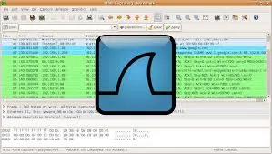
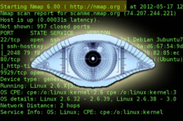
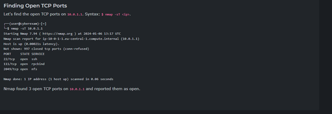
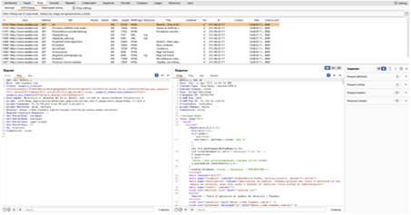

# Etik Hackerlık ve Sızma Testi Simülasyonu 
## Hacker 
Hacker, hedefine normalden farklı yollarla ulaşan, teknoloji alanında yetkin, yetenekli 
kişidir. Aslında bilindiği gibi sadece kötü yollarla verileri çalmaya çalışan kişi değildir. 
Tanımı biraz daha araştırırsak; 
    • White hat hacker 
    • Grey hat hacker 
    • Black hat hacker 
Olarak 3’e ayrıldığını göreceğiz. Bu projemde kapsamlı olarak sadece White hat’e 
değineceğim, diğerlerini yüzeysel olarak geçeceğim. 

### Siyah şapkalı hacker (Black hat hacker) 
Black hat hacker, Sistemlere zarar veren, sistemdeki bilgileri çalan ve sisteme izinsiz 
erişim sağlayan kötü amaçlı hackerlara verilen isimdir.  

### Gri şapkalı hacker (Grey hat hacker) 
Gri şapkalı hackerlar, kendi doğrusunu için istediği şeyi yapabilecek hackerlara verilen 
isimdir. Neyin doğru neyin yanlış olduğuna kendileri karar verirler. Black hat hackerların 
kullandığı yöntemleri ve araçları bilen, bazen yasaları ihlal eden, fakat genelde hukuk 
çerçevesinde iş yapan, uzman etik standartlarını ihlal etmeyen hackerlar bütünüdür. 

### Beyaz şapkalı hacker (White hat hacker) 
Beyaz şapkalı hacker, black hat hackerların kullandığı yöntemleri ve araçları bilen, iyi 
niyetli hackerlardır. Bu tür hackerlar hukuk çerçevesi dışına çıkmayacak işler yapar. Bu 
tür hackerlar genellikle devlet, istihbarat ve para için yapmaktadır. 

## Penetrasyon testi
Sızma testi, sistemler, ağlar ve diğer teknoloji altyapılarında güvenlik açıklarını 
belirlemek için yapılan kritik bir güvenlik değerlendirmesidir. Bu testler, bir siber 
saldırının sisteminizi ne kadar etkileyebileceğini anlamak ve güvenlik önlemlerini 
güçlendirmek amacıyla uygulanır. Sızma testi, siber güvenlik alanındaki en iyi uygulama 
standartlarını takip ederek potansiyel riskleri analiz eder.  
Pentest sırasında kullanılan birden çok araç vardır. Burada bilinmesi gerekenlerden 
bahsedeceğim. 
    • Nmap 
    • Wireshark 
    • Metasploit  
    • Burpsuite 
    • Nikto 
Eğer türetmek istersek türetebiliriz fakat dediğim gibi, burada hayati önem taşıyan 
toollara değineceğiz.
## Toollar
### Wireshark
Yüzlerce farklı protokolü derinlemesine inceleyebilen bir araçla web uygulamalarını test edebilmemizi sağlayan mükemmel bir araç.

Bu aracı bu kadar önemli yapan şey, bir ağ paketi dinleyicisi ile entegre olmasıdır. Bu sayede yüzlerce protokol üzerinde derinlemesine bir inceleme yapılabilir.	
Web uygulamaları için normal sızma testi araçlarından farklı kılan bir diğer şey de kullanım kolaylığıdır. Verileri kolayca sıkıştırabilir, açabilir ve dışa aktarabilirsiniz

### NMAP
Network Mapper'ın kısaltması olan Nmap, çoğu pentester tarafından tavsiye edilen bir pentest aracıdır. Bu araç, kullanıcıların web uygulamaları için sızma testi yapmasına ve kullanıcıların ağlarını taramasına olanak tanır.

Ağ taraması, uygulamanızda kalan güvenlik açıklarını kontrol etmenize olanak tanır. Bu, web uygulamalarına tam olarak sızma testi yapabileceğiniz anlamına gelir.
Aşağıdaki fotoğrafta ağ taraması yapma örneği verilmiştir

Burada Portları durumları ve servisleri görebiliriz. (örn: Port 22, State open, Service SSH)
komutun tam haline erişmek ve yukarıdaki görseldeki ekstra parametleri öğrenmek için Linux terminalimize; 
    •	man nmap
Yazıp nmap hakkında her türlü bilgiye erişebiliriz.

### Metasploit
Metasploit, penetrasyon testi için gelişmiş ve popüler bir çerçevedir.

Metasploit sadece sistemin zayıflıklarını tanımlamakla kalmaz, aynı zamanda bunları daha fazla kullanmaya çalışır. Sonuç olarak,
kusurları hızlı bir şekilde izole edebilir ve gösterebilir ve bir şeyleri düzeltebilirsiniz.
Ayrıca, Metasploit manuel istismarları ve testleri otomatikleştirme yeteneği sunar.

### Nikto
Nikto, web uygulamalarınızı potansiyel güvenlik tehditlerine karşı test etmenize yardımcı olan açık kaynaklı bir tarayıcıdır. Derinlemesine testler yapabilir ve yaklaşık 7000 kötü amaçlı uygulama ve dosyayı yakalayabilir.

### Burp suite
Burp Suite olmazsa olmazımızdır. PortSwigger tarafından geliştirilmiş bir araçtır. Genellikle sızma testi uzmanları tarafından kullanılır. Hatta portswigger’ın kendi sitesinde Burp suite eğitimlerine ücretsiz bir şekilde erişebilirsiniz.   
[Portswigger Academy](https://portswigger.net/web-academy)

## Hack the pentagon
Hack the Pentagon, ABD Savunma Bakanlığı tarafından 2016 yılında başlatılan bir bugbounty (hata avı) programıdır. Aslında bu program, Bakanlığın belirli web uygulamalarında kontrollü bir “sızma testi” yapılmasına olanak tanımıştır.
Buradaki amaç, Kamuya açık sistemlerdeki açıkları tespit etmek ve bunları sorumluluk çerçevesinde raporlayan araştırmacıları ödüllendirmekti. Böylece hem güvenlik güçlendirildi hem de toplulukla iyi ilişkiler kuruldu.
Sonuçlar gerçekten iç açıcıydı, programın daha ilk aşamasında birçok güvenlik açığı bildirildi ve bunlara karşı önlemler alındı. Bu kurum içindeki güvenlik sorunlarının çok daha erkenden fark edilmesini sağladı.