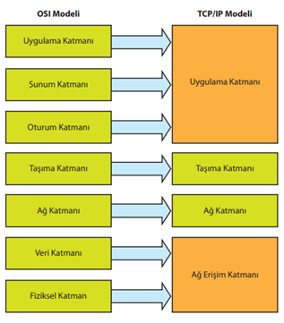
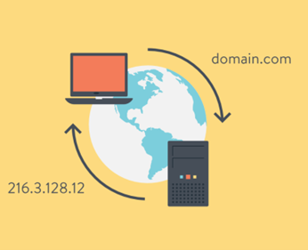
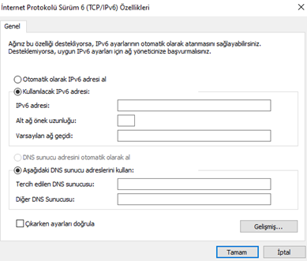
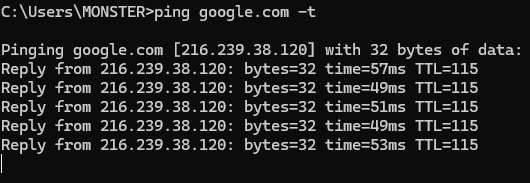
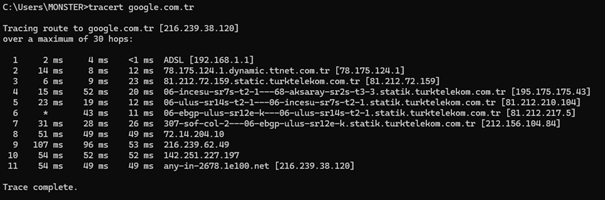
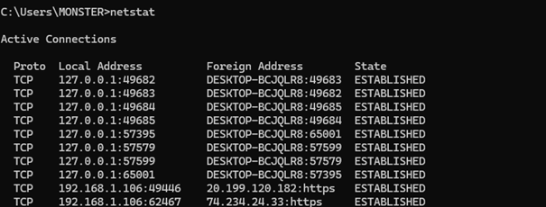

# Literatür Taraması
## OSI Modeli
OSI modeli, 7 katmandan oluşan soyut bir modeldir. Her katmanın kendine özgü bir görevi vardır ve protokoller bu katmanlar aracılığıyla veri iletimini sağlar. Yukarıdaki tablo, OSI modelinin katmanlarını, görevlerini ve örnek protokolleri göstermektedir. 
| Katman No | Katman Adı       | Görevi                            | Örnek Protokoller        |
|-----------|------------------|-----------------------------------|---------------------------|
| 7         | Application       | Kullanıcıya en yakın katman       | HTTP, FTP, DNS            |
| 6         | Presentation      | Veriyi şifreler/formatlar         | SSL, TLS                  |
| 5         | Session           | Oturum yönetimi                   | NetBIOS, RPC              |
| 4         | Transport          | Veriyi bölüp iletir               | TCP, UDP                  |
| 3         | Network           | IP adresleme, yönlendirme         | IP, ICMP                  |
| 2         | Data Link         | MAC adresleme, çerçeveleme        | Ethernet, ARP             |
| 1         | Physical          | Fiziksel iletim                   | Kablolar, Hubs            |

## TCP - IP
TCP/IP modeli, pratik uygulamalarda internetteki etkileşimi daha iyi sunan 4 katmandan oluşur. 
4- Application	http, ftp, smtp
3- Transport 		tcp, udp
2-İnternet		    ip, icmp, arp
1-Link Layer		ethernet, wifi

## IP ADRESLEME

### IPv4
32 bit kullanılarak adresleme yapılır, sonuç olarak yaklaşık 4,3 milyar adres var. Adres yapısı A.B.C.D şeklinde, örnek 192.168.0.1. Subnet mask (örneğin 255.255.255.0), varsayılan ağ geçidi ve DNS sunucuları ile çalışır.

### IPv6
Adres uzunluğu 128 bit olup, adresleme çok daha geniş bir alan sağlar, örnek 2001:0db8:85a3:0000:0000:8a2e:0370:7334. IPv4 adreslerinin tükenmesi sonrası önem kazanmıştır.

### Subnetting
Bir ağı daha küçük alt ağlara bölme, IP adreslerinin daha etkin kullanılmasını sağlar. Subnet mask kullanılarak IP adresinin bir kısmı ağ kimliği olarak kullanılırken, kalan kısmı host kimliği olarak kullanılır.

## Ag Protokolleri
80 HTTP (Hyper Text Transfer Protocol – Hiper Metin Transfer Protokolü)  
Http protokolü dünya çapında ağ üzerinden veri gönderebilmek üzerine kurulmuş bir protokoldür. Bilgisayarımızdaki web browser ile bir web sitesini açmak istediğimizde bu protokol devreye girer. Web sayfasının sunulduğu sunucuya bir istek gider ve karşılığına site verisi karşımıza getirilir. 

### 53 DNS (Domain Name System, Alan Adı Sistemi) 
Bu protokol günümüzde HTTP ve HTTPS ile kullanılmaktadır. Browserı açtığımızda bir web sayfasına ulaşabilmek için, web sayfasının barındığı sunucunun ip adresini yazmamız gerekmektedir. Bir ip adresinde sorun olmasa da günümüzde bu durum imkansızdır. Burada DNS protokolü devreye girer. DNS protokolü kısaca web sayfalarının IP adresine bir isim vermektir diyebiliriz.

### 21 FTP (File Transfer Protokol – Dosya Transfer Protokolü)
Ağ üzerinden dosya transfer edilmesini sağlayan protokoldür. Ağda yer alan birçok sunucu kendisinde depolanan verilere ulaşılabilmesi için kullanıcı adı ve şifre talep eder. Kullanıcı girişi başarı ile yapılmış ise dosya indirme işlemi başlar. Bazı durumlarda ise anonim yanı kullanıcı adı ve şifre istenmeden de girişi yapılabilmektedir. FTP protokolü, TCP taşıma katmanını kullanarak dosyaların güvenli ve eksiksiz iletilmesini sağlar.

### 25 SMTP (Simple Mail Transfer Protocol – Basit Posta Gönderim Protokolü)
E-Posta gönderimi için hazırlanan bir protokoldür. Gönderilen mailin güvenli ulaşmasını sağlar. İstemci sunucu ise gelen postaları POP3 ya da IMAP protokolleri ile alır.

### - ARP (Address Resolution Protocol)
Bir ağa bağlı cihazlar birbirleri ile haberleşmek için IP adresine değil Ethernet kartlarının ROM belleklerinde yazılı olan MAC (Media Access Control – Ortam Erişim Kontrolü) üzerinden iletişim sağlamaktadır. MAC adresler fabrika çıkışı sırasında o karta verilir ve normal yollarla değiştirilemezler. Basitçe IP adreslerini MAC adreslerine çevirir, yerel ağdaki cihazların birbirini bulmasını sağlar.

### - ICMP (Internet Control Message Protocol)
Internet Control Message Protocol, hata mesajları ve TCP/IP yazılımının bir takım kendi mesaj trafiği amaçları için kullanılır. ICMP RFC 792'de tanımlanmış ve RFC 950'de yenilenmiştir. Hataları raporlamak için kullanılan, kontrol amaçlı bir protokoldür. Ping ve traceroute gibi araçlar bu protokolü kullanır.
67/68 DHCP (Dynamic Host Configuration Protocol)
DHCP, ağda bulunan her bir bilgisayarın IP adresi, alt ağ maskesi, varsayılan ağ geçidi ve DNS sunucuları gibi ağ bağlantısı ayarlarının otomatik olarak atamasını sağlar.
Temel Ağ Donanımları
Router: Farklı ağlar arasında veri paketlerini yönlendirir, ağlar arası bağlantı sağlar.

#### Switch
Aynı ağ içerisinde veri paketlerini uygun portlara iletir, ağ trafiğini optimize eder.

#### Hub
Gelen veriyi tüm portlara yayar, kullanımı artık minimum düzeydedir.

#### Access Point
Kablosuz ağ erişimi sağlar, Wi-Fi bağlantı noktası olarak çalışır.

#### Firewall 
Ağ güvenliğini sağlar, iç ve dış ağ trafiğini kontrol eder ve filtreler.

# Komutlar
## Ping
Ping komutu, ağ bağlantılarının temel işlevselliğini test etmek için kullanılan pratik ve yaygın bir araçtır.
MS
53-54 ms, bir paketin hedefe gidip gelip size geri dönmesi için yaklaşık 53-54 milisaniye harcandığını gösterir.
TTL
TTL, bir IP paketinin ağ üzerinde dolaşabileceği maksimum "yaşam süresini" ya da geçebileceği router (hop) sayısını belirler. Her router geçişinde bu değer 1 azalır. TTL değeri 0’a ulaştığında paket, bir sonraki yönlendirici tarafından düşürülür.

## Tracert
tracert komutu, veri paketinin hangi yönlendiricilerden geçtiğini adım adım görmenizi sağlayan, ağ tanılama açısından oldukça güçlü bir araçtır. Hem yerel ağınızın hem de internet servis sağlayıcınızın ve hedef sunucunun hangi noktada yer aldığını gözlemleyebilir, gecikme ve olası sorunları tespit edebilirsiniz.
Yukarıdaki resimde de görüldüğü gibi 11 adet hop vardır. Hepsinin ms’ini resimde görebiliyoruz. Son gelen yerde de google’ın bir domainini görüyoruz. 49-54 ms arası değişiklik gösterdiğini görebiliyoruz.

## netstat
netstat (network statistics), sisteminizdeki ağ bağlantılarını, dinleme portlarını, yönlendirme tablolarını ve protokol istatistiklerini görüntülemek için kullanılan komut satırı tabanlı bir araçtır.
Yukarıdaki çıktıyı ele alarak inceleyelim;
Proto: Bağlantının kullandığı protokol (TCP veya UDP). 
Local Address: Kendi sisteminizdeki IP adresi ve port numarası.
Foreign Address: Bağlandığınız uzak sunucunun IP adresi ve port numarası.
State: Bağlantının durumunu gösterir. Yaygın durumlar arasında;
•	LISTENING: Bir port üzerinden gelen bağlantıları dinliyor.
•	ESTABLISHED: Aktif, kurulan bir bağlantı var.
•	TIME_WAIT: Bağlantı kapatıldıktan sonra, son paketlerin yavaşlamaması için belirli bir süre bekleniyor.

