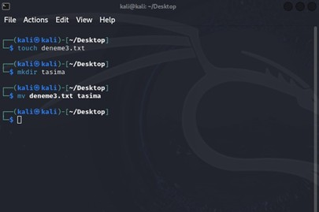

# Linux 
Linux, 1991 yılında Linus Torvalds tarafından geliştirilmeye başlanan ve günümüzde sunucu, masaüstü ve güvenlik testleri gibi birçok alanda tercih edilen açık kaynaklı bir işletim sistemidir. Bu rapor, Linux’un tarihçesi, yaygın dağıtımları, dosya sistemi yapısı, temel komutları ve kullanıcı yönetimi gibi konuları kısaca ele alarak, sistemin teknik ve güvenlik yönlerini özetlemeyi amaçlamaktadır. 
Yaygınlıkları ve GNU/Linux dünyasına katkılarıyla öne çıkan bazı dağıtımlar vardır: Debian, Ubuntu, Red Hat, Fedora, Linux Mint, openSUSE ve Arch Linux bunlardan birkaçıdır. Bir GNU/Linux sistemi bilgisayara kurulmadan CD-ROM veya USB Bellek üzerinden çalışabilecek şekilde de tasarlanabilmektedir. Bir dağıtımın bu şekilde kurulmadan kullanılabilen sürümüne "canlı sistem" denilmektedir. 
## Dosya Sistemi Yapısı 
Linux dosya yapısını gösteren bir cheat sheat -> 

 Şimdi bu dosya yapısını tek tek ele alalım:
### /root 
Sistem içerisinde istediği her şeyi yapabilen en yetkili kişidir. ve /root dizini root kullanıcısının ana dizinidir. 
”/” kök dizini ile “/root/” dizini birbirinden tamamen farklı dizinlerdir,karıştırılmamalıdır. 
Her dosya ve dizin root dizinden başlar. 

### /bin 
Çalıştırılabilir Binary dosyalarını içerir. 
Kullanmanız gereken genel linux komutları bu dizin altında bulunur (ping, ls, cp, rm, vb). 
Sistemin açılması ve çeşitli kontroller için ihtiyaç duyulan komutlar bu dizinde bulunur. 

### /etc 
Tüm programların gerektirdiği konfigürasyon dosyalarını içerir.  
Bireysel programları başlatmak/durdurmak için kullanılan başlatma ve kapatma komut dosyalarını da içerir.  
Örnek: /etc/resolv.conf, /etc/logrotate.conf 

### /dev 
Cihaz dosyalarını içerir. 	 
Bunlara terminal aygıtları, USB veya sisteme bağlı herhangi bir aygıt dahildir. 

### /var 
Var, değişken dosyalar anlamına gelir. 
Büyümesi beklenen dosyaların içeriği bu dizin altında bulunabilir. 
Var’ı sistem günlük dosyaları olarak söyleyebiliriz. 
### /usr 
“Unix Sistem Kaynakları”nın kısaltması olarak da adlandırılır. 
/usr/lib, /usr/bin ve /usr/sbin için kütüphaneler içerir. 
/usr/local kaynaktan yüklediğiniz kullanıcı programlarını içerir. Örneğin, Apache’yi kaynaktan yüklediğinizde, /usr/local/Apache2 altına gider 
### /home 
Kullanıcıların ana dizinidir. 
Her yeni kullanıcı yaratıldığında onun adında dizin yaratılır. /home dizini altında o kullanıcıya ait desktop, documents, downloads gibi klasörler yer alır. 
Tüm kullanıcıların kişisel dosyalarını depolayabilecekleri dizindir  
Örneğin: /home/enesdemir /boot 
Sistem boot olurken ihtiyaç duyduğu tüm dosyaları içerir. 
Çekirdek initrd, vmlinux, grub dosyaları /boot altında bulunur. 
 
Dosya dizinleri bu kadarla sınırlı kalmamakta. Ben burada önemli olanlara değinmek istedim.  

## Temel komutlar
### cd  
cd, Linux’un en kullanışlı komutlarından birisidir hatta en kullanışlısı bile diyebiliriz. Bu komutun yardımıyla kullanıcı istediği zaman istediği dizine kolaylıkla gidebilir. Bu komut, kullanıcının mevcut çalışma dizinini, kullanıcının gezinmek istediği dizin adına değiştirir.

### mkdir 
mkdir, yeni bir klasör oluşturmka için kullandığımız komut “mkdir” örneğin; mkdir deneme1 
ayrıca iç içe klasör oluşturmak için “-p parametresini kullanın”

 

### rmdir 
rmdir, bu komut bir directory nesnesini sistemimizden tamamen kaldırmak için kullanırız. Klasörleri silmek için kullanırız. Sadece boş dizinleri siler! Örneğin; “rmdir deneme1”  

 

### rm 
rm, bir dosya veya klasörü silmemizi sağlıyor

 

### mv
mv, adından da anlaşılabileceği üzere move, bir dosyanın konumunu değiştirmek için kullanılır.  
Sağdaki görselde de anlaşılabileceği üzere deneme3.txt adında bir dosya ve tasima adında bir klasör oluşturup. Deneme3.txt yi tasima adlı klasöre mv komutu ile taşıdık 

### cp 
cp, adından da anlaşılabileceği gibi copy, Dosya veya klasör kopyalarken kullanıyoruz. 

### chmod 
chmod, Klasör ve içindeki tüm dosya ve dizinlerin izinlerini değiştirmek için -R recursive şeklinde beraber kullanıyoruz. Örnek:  
bu resimde, “others” izinlerini sıfırlamak için kullanıyoruz. Bu da eğer özel bir şeyimiz varsa daha güvenli bir ortam altına alıyor. 

### chown 
chown, Bir dosya veya dizinin sahibini değiştirmek için kullanılır.  
Örneğin: Bu komutla birlikte dosyanın sahibi “kali” kullanıcısı oldu 

### chgrp 
chgrp, Dosya veya dizinin grup bilgisini değiştirmek için kullanılır.  
Örneğin: ilk başta groupadd komutu ile siber adlı bir grup oluşturalım. Sonrasında masaüstündeki “sa” adlı klasörü siber grubuna alalım. 

### apt-get update, apt-get upgrade, apt-get install 
apt-get update, paket yöneticisinin kullandığı paket listelerini günceller. En güncel paket bilgilerini yükler. Bu komut, paket yöneticisinin veritabanını en son haline getirir. 
Ardından apt-get upgrade gibi komutlar ile sistemindeki paketleri güncelleyebilirsin. 

Bu örnekte hem apt-get update hem de apt-get upgrade komutunu görmüş olduk. 

### useradd 
useradd, kullanıcı oluşturmaya yarayan komut 
Örneğin: kerpetenes adında bir kullanıcı oluşturmak için:
“passwd kerpetenes” yazarak da şifreyi değiştirebiliriz.  
Peki bu kullanıcıya nasıl sudo yetkisi vereceğiz; “sudo usermod -aG sudo kerpetenes” komutuyla verebiliriz. Verdikten sonra sudo whoami komutu ile test edebiliriz.  

## Ağ taraması 
İlk başta ifconfig komutu ile ağ içerisindeki ip adresini öğreniyorum. Daha sonra “sudo nmap -sn ipadresi/24” komutu ile tarama yapıyo  rum. 
Bu komut ile mac adresleri görüntüleyebilirim ve ekstra olarak open portlara bakmak için sudo nmap -sS ipadresi/24 şeklinde tarama yapacağım 

# Senaryo
## Güncellemelerin Yapılmaması Nedeniyle Eski Sürüm Servis Üzerinden Yapılacak Saldırı 
Bir şirketin Linux sunucusunda, kritik sistem dosyalarından biri (örneğin, /etc/shadow veya /etc/sudoers gibi) dosya izinlerinin yanlış yapılandırılması sonucu, yetkisiz bir kullanıcının bu dosyaya erişim sağlayabildiği tespit edilmiştir. Sistem yöneticisi, dosya izinlerindeki bu eksikliğin farkında olmadan dosyaları geniş erişime açmıştır. Sonuç olarak, saldırgan veya kötü niyetli bir kullanıcı bu dosyayı okuyarak kullanıcı şifrelerini ele geçirme veya sudo ayrıcalıklarını kötüye kullanma riski doğmuştur. 
Sistem yöneticisi, yeni bir servis kurulumu veya bakım işlemi sırasında kritik dosyalara yönelik izinlerde geçici değişiklik yapar ancak bu değişikliği kalıcı hale getirmeyi unutur. 
/etc/shadow dosyasının normalde yalnızca root tarafından okunabilir olması gerekirken, dosya izinlerinin hatalı yapılandırılması sonucu normal kullanıcılar da dosyayı okuyabilir hale gelir. 
Kötü niyetli bir kullanıcı, bu zayıf yapılandırmadan faydalanarak /etc/shadow dosyasını inceler ve hash'lenmiş şifreleri elde eder. Daha sonra bu hash'ler üzerinde parola kırma yöntemleri kullanılarak sistemdeki kullanıcı hesaplarına erişim sağlanır. 
Normalde, /etc/shadow dosyası sadece root tarafından okunabilmelidir. Doğru izinler bu şekiled olmalı: 
    •	sudo chown root:shadow /etc/shadow 
    •	sudo chmod 640 /etc/shadow 
Bu ayarlamalar sayesinde, yalnızca root ve shadow grubuna üye kullanıcılar dosyayı okuyabilir. 
    •	sudo chown root:root /etc/sudoers 
    •	sudo chmod 440 /etc/sudoers 
Sorun: 
Yanlış yapılandırılmış dosya izinleri, kritik sistem dosyalarının yetkisiz kullanıcılar tarafından erişilmesine ve potansiyel güvenlik ihlallerine neden olmaktadır. 
Alınması Gereken Önlemler: 
    •	Kritik dosyaların sahiplik ve izinlerinin doğru yapılandırılması. 
    •	Dosya bütünlüğü izleme araçları ve düzenli denetimlerin kullanılması. 
    •	Sistem loglarının sürekli izlenmesi ve güvenlik politikalarının uygulanması. 
    •	Sistem yöneticilerinin düzenli olarak eğitim alması ve konfigürasyon yönetimi süreçlerinin iyileştirilmesi. 
Bu senaryodan sonuç çıkartarak dosyaların doğru yapılandırmasına dikkat edebilrisiniz. 
 
 
 
 
 
 
